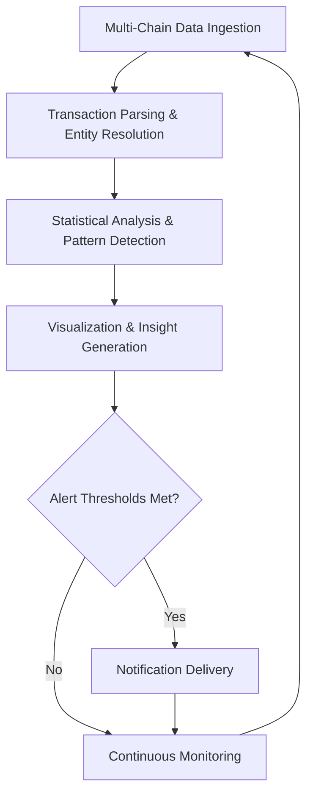

# On-Chain Analytics Tool

Deploy On-Chain Analytics Tool as a real-time blockchain data aggregation and visualization execution layer for tracking wallet activity, token flows, smart contract interactions, and market metrics across Ethereum, Solana, and major chains.

### Introduction to On-Chain Analytics Platforms

Blockchain data provides unparalleled transparency into market activity. An **On-Chain Analytics Tool** functions as a comprehensive **data aggregation and intelligence engine** that processes raw blockchain transactions into actionable insights for traders, researchers, and analysts.

Users leverage these tools to understand whale movements, token distribution, DeFi activity, and emerging trends directly from on-chain data.

### Inside the System: Core Mechanism

The tool operates as a **multi-chain indexer and analytics processing layer**. It ingests:

- Raw transaction data from RPCs and indexers
- Token transfer and smart contract interaction logs
- Wallet activity and balance changes
- DeFi protocol interactions and liquidity events

The engine applies statistical analysis, pattern recognition, and visualization to generate insights on flows, concentrations, and anomalies.

### Target Audience and Practical Use Cases

This execution layer targets:
- On-chain analysts and researchers
- Traders tracking whale and smart money activity
- DeFi users monitoring protocol health
- Project teams analyzing their token economics

Common applications include:
- **Whale movement and smart money tracking**
- **Token holder distribution analysis**
- **DeFi TVL and liquidity monitoring**
- **Market sentiment inference from on-chain activity**

### Technical Architecture and Operational Logic

A robust On-Chain Analytics Tool includes:

- **Data Ingestion Layer**: Multi-chain RPC and indexer connections
- **Processing Engine**: Transaction parsing and entity resolution
- **Analytics Core**: Statistical analysis and pattern detection
- **Visualization Dashboard**: Interactive charts and heatmaps
- **Alert System**: Custom notifications for significant events

**Operational Logic Flowchart**

### Key Features and Technical Advantages

- **Multi-Chain Coverage**: Ethereum, Solana, Layer 2s, and emerging ecosystems
- **Real-Time Processing**: Low-latency data analysis and alerts
- **Advanced Visualization**: Interactive dashboards and heatmaps
- **Custom Querying**: User-defined metrics and filters
- **Integration Ready**: API support for trading and research workflows

The system provides deeper, data-driven insights than surface-level explorers.

### Where It Fits in the Market: Comparison Table

| Aspect                | On-Chain Analytics Tool | Basic Block Explorers | Dune Analytics        | Nansen or Arkham     |
|-----------------------|-------------------------|-----------------------|-----------------------|----------------------|
| Analysis Depth       | Comprehensive          | Transaction-level     | Query-based           | Entity-focused       |
| Real-Time            | Strong                 | Good                  | Moderate              | Strong               |
| Visualization        | Advanced dashboards    | Basic                 | Customizable          | Professional         |
| Multi-Chain          | Broad                  | Per-chain             | Good                  | Broad                |
| Best Use Case        | General on-chain intel | Transaction lookup    | Custom queries        | Entity tracking      |
| Accessibility        | User-friendly          | Technical             | Technical             | Professional         |

### Risk Surface and Limitations

On-chain analytics tools have practical limitations:
- **Data Completeness**: RPC/indexer gaps can miss transactions
- **Interpretation Risk**: Raw data requires context for accurate conclusions
- **Privacy Considerations**: Public data analysis must respect ethical boundaries
- **Cost for High Volume**: Advanced features may require premium subscriptions
- **Evolving Blockchain Standards**: New chains or standards may have delayed support

**Optimization Note**: Cross-reference insights with multiple tools, apply domain knowledge for interpretation, and use alerts as starting points for deeper investigation. On-chain data is one piece of the broader market puzzle.

### Deployment Profile and Getting Started

1. **Tool Selection**: Choose based on supported chains and analysis depth.
2. **Basic Usage**: Add addresses or contracts for monitoring.
3. **Dashboard Configuration**: Set up custom views and alert rules.
4. **Integration**: Connect APIs to trading or research workflows.
5. **Advanced Use**: Create custom queries or integrate with automated systems.

Many solutions offer intuitive web interfaces with extensive documentation.

### Conclusion

The On-Chain Analytics Tool serves as a powerful data intelligence execution engine for extracting insights from blockchain activity. Its value lies in comprehensive data aggregation, advanced visualization, and real-time processing rather than any predictive guarantee. For analysts and traders who combine it with broader market context and critical thinking, it provides significant advantages in understanding on-chain dynamics.

### FAQ

**How real-time is on-chain analytics?**  
High-quality tools provide near-real-time insights, though minor delays can occur during network congestion or indexer lag.

**Does it support all major blockchains?**  
Leading tools cover Ethereum, Solana, Layer 2s, and others with regular additions for new ecosystems.

**Can it track specific wallets or contracts?**  
Yes. Users can monitor any public address or smart contract with customizable alerts and dashboards.

**What are the main limitations?**  
Data gaps, interpretation challenges, and the fact that on-chain activity is only one part of market dynamics. Combine with off-chain analysis for best results.

**How does it compare to basic block explorers?**  
On-chain analytics tools provide aggregated insights, visualization, and alerting that basic explorers lack, making them far more powerful for research and trading decisions.
